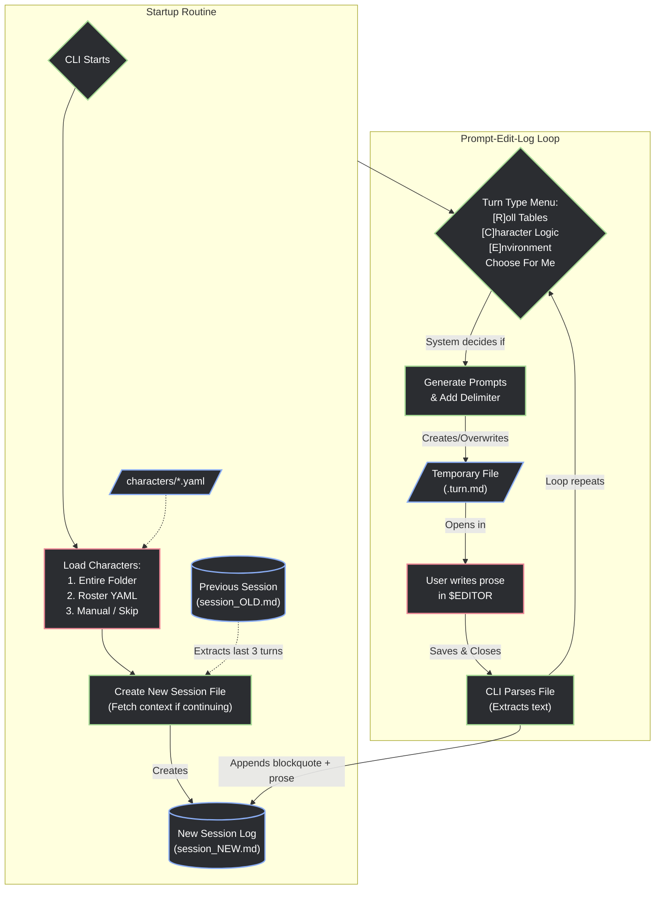

Here is the revised flow diagram showing the new startup routine and the immutable session handling.

By decoupling characters into their own files and isolating sessions by timestamp, the system acts much more like a true project manager or "game engine" while keeping the data format incredibly simple to edit by hand. 